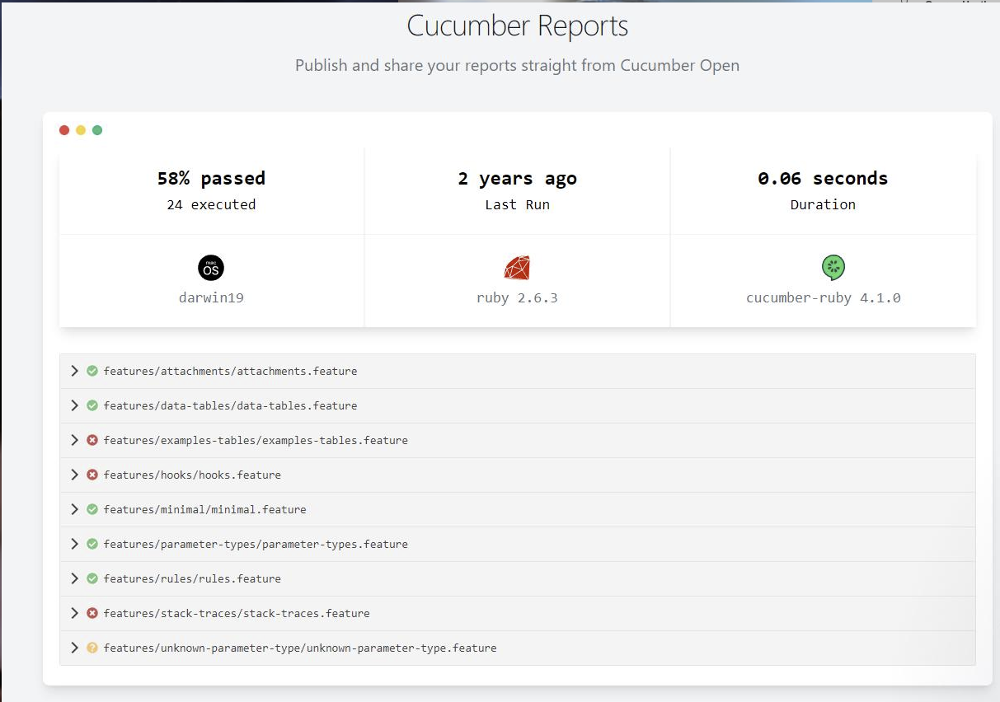

# Engineering 112 Final Project

Application that cleans records, adds to a database, and then allows users to filter and select data using an API

## Set Up
*Software Requirements*
- JDK 17
- MySQL

*Setup database*
- Create database 'films' in MySQL
- Run schema.sql from src/main/resources/schema.sql
- Create mysql.properties file and put username and password.

## Description / how to use (how to use can be separated later)
**How to use**
- Download project from intellij.
- Run Maven compile to build the project.
- Run ImdbMoviesApiApplication.java class.

## Quality Assurance
*How to run Test*
Run the following on the terminal

    > mvn clean test

**Cucumber used for end to end tests**

*The image shows the cucumber test report which shows that film data from csv has been loaded successfully**

- Junit used for unit testing giving above 80% coverage
- Quality Gate used to check the overall code quality

## (Optional) Creation Process
*add how we tackled this project, the steps we took and what order, optional as it can be combined with diffictuties.

## (Optional) Difficulties / learning experiences
*add details of any issues*

## Links
*any useful links*

## Contributors

 Jack Mardell, Daniel Webb, Mustapha Chedid, Luke Homer, George Heath, Youmna Khan, Ahmad Abubakar,Adil Salamat
